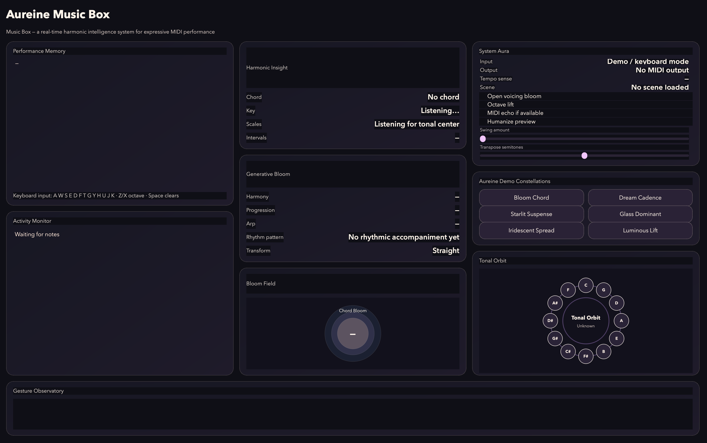
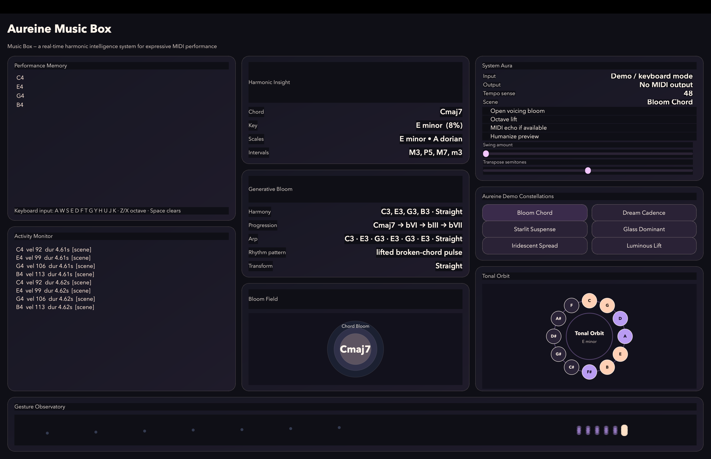
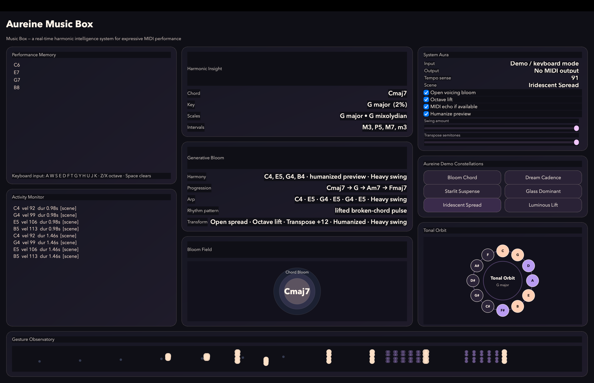
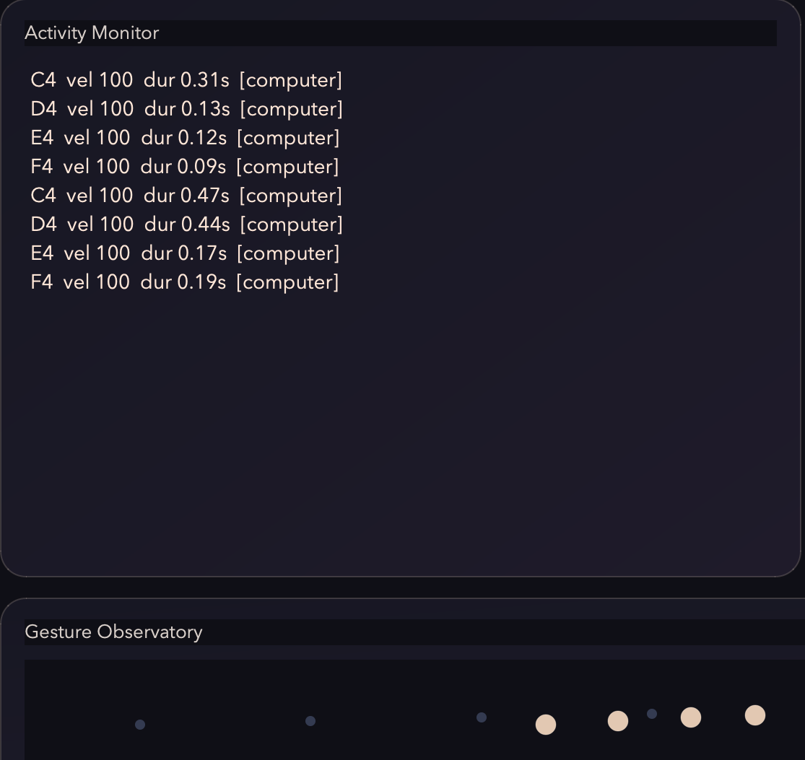

# ✧ Aureine Music Box

> *a real-time harmonic intelligence system for expressive MIDI performance*

---

## ♡ Overview

**Aureine Music Box** is a real-time MIDI intelligence engine that listens, understands, and responds to musical input.

<<<<<<< HEAD
It transforms live performance into structured musical insight — revealing harmony, tonal direction, and expressive possibilities as you play.
=======
It transforms live performance into structured musical insight revealing harmony, tonal direction, and expressive possibilities as you play.
>>>>>>> ac93b673e2063cf4f2c9bed644291dee9684f1c5

Designed as part of **Aureine Audio Systems**, this project blends:

- ✦ technical precision  
- ✦ musical intuition  
- ✦ soft, expressive visual design  

---

## ✧ Core Capabilities

### ♫ MIDI Awareness
- real-time note tracking  
- velocity + duration sensing  
- polyphonic input handling  

### ✧ Musical Intelligence
- chord detection  
- key estimation  
- scale recognition  
- interval analysis  

### ♡ Generative Response
- harmony suggestions  
- chord progression ideas  
- arpeggiator previews  
- rhythm + tempo inference  

### ✧ Transformations
- open voicing bloom  
- octave lift  
- transpose control  
- humanization preview  
- swing shaping  

---

## ✧ Visual System

The interface is designed as a **musical observatory**, where sound becomes visible:

- ✦ **Chord Bloom** — harmonic center visualization  
- ✦ **Tonal Orbit** — pitch-class mapping  
- ✦ **Gesture Observatory** — real-time note activity  
- ✦ **Activity Monitor** — expressive performance feedback  

---

## ♫ Controls

**Keyboard Input**
<<<<<<< HEAD
=======

>>>>>>> ac93b673e2063cf4f2c9bed644291dee9684f1c5
A W S E D F T G Y H U J K → notes
Z / X → octave shift
Space → clear notes

<<<<<<< HEAD
=======

>>>>>>> ac93b673e2063cf4f2c9bed644291dee9684f1c5
---

## ✧ Demo Constellations

- Bloom Chord  
- Dream Cadence  
- Starlit Suspense  
- Glass Dominant  
- Iridescent Spread  
- Luminous Lift  

---

## ✧ Tech Stack

- Python  
- PySide6 (UI)  
- PyQtGraph (visualization)  
- MIDI (optional input/output)  

---

## ♡ Inspiration

Inspired by modern music technology tools used in professional environments  
<<<<<<< HEAD
such as **Yamaha, Ableton, and Native Instruments** —  
=======
such as **Yamaha, Ableton, and Native Instruments**  
>>>>>>> ac93b673e2063cf4f2c9bed644291dee9684f1c5
while maintaining a distinct **Aureine aesthetic identity**.

---

## ✧ Demo

<<<<<<< HEAD
🎥 *[Add your demo video here]*
=======
🎥 https://youtu.be/eQDCkgNJ8cs
>>>>>>> ac93b673e2063cf4f2c9bed644291dee9684f1c5

---

## ✧ Screenshots

### ✧ Interface

### ✧ Harmonic Bloom

### ✧ Full System State

### ✧ Gesture Observatory

### ✧ Tonal Orbit

---

## ♡ About

Created as part of **Aureine Audio Systems**  
where music, code, and emotion are designed together.

✧
