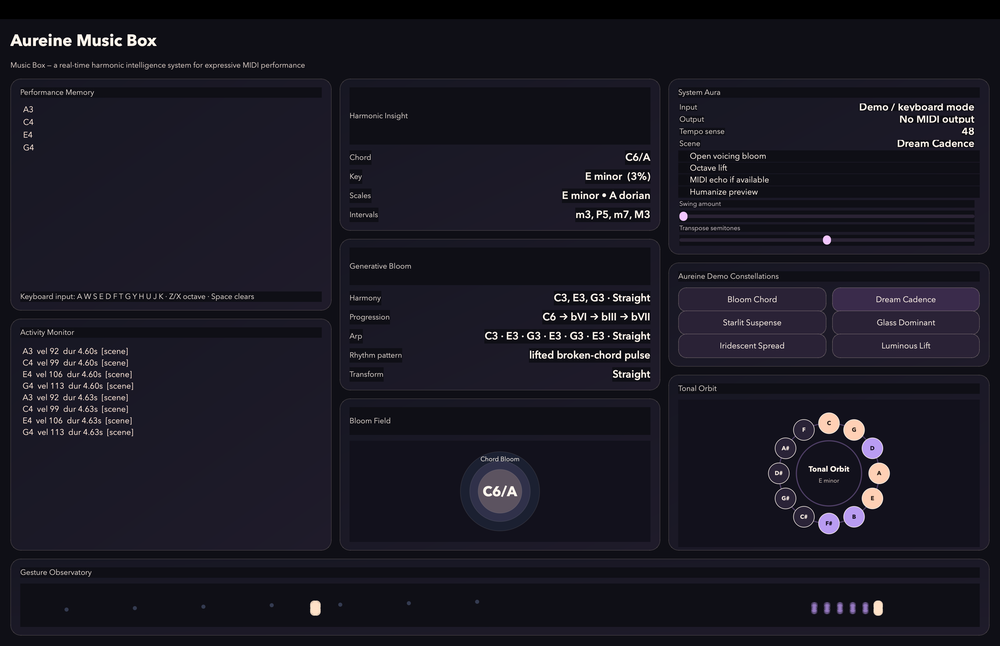

# ✧ Aureine Music Box

> *real-time MIDI → harmonic intelligence → generative response*

<p align="center">
  
</p>

---

## ✧ Demo

🎥 https://youtu.be/eQDCkgNJ8cs

---

## ♡ Overview

**Aureine Music Box** is a real-time MIDI intelligence system that listens to musical performance, understands harmonic structure, and responds with expressive visual and musical feedback.

Rather than simply displaying notes, the system transforms performance into **musical understanding** — revealing chords, tonal direction, and expressive possibilities as you play.

Designed as part of **Aureine Audio Systems**, this project blends:

* ✦ real-time systems
* ✦ musical cognition
* ✦ expressive interface design

---

## ✧ System Overview

Aureine Music Box operates as a continuous real-time feedback system between performer and software.

The system:

* captures MIDI or keyboard input
* tracks active notes, timing, and velocity
* infers harmonic structure (chords, keys, scales)
* generates musical suggestions
* visualizes tonal relationships in real time

This creates a loop where the system behaves like a **musical collaborator**, not just a tool.

---

## ✧ Architecture

```
MIDI Input → State Engine → Harmonic Analysis → Generative Engine → Visualization
```

**Input Layer**
Captures MIDI or keyboard note events in real time

**State Engine**
Maintains active note sets, timing, and expressive state

**Harmonic Analysis Engine**
Computes:

* chord identity
* key estimation
* scale candidates
* interval relationships

**Generative Layer**
Produces:

* harmonic accompaniment suggestions
* chord progression ideas
* arpeggiator previews
* rhythm patterns

**Visualization Layer**
Renders musical structure as an evolving visual system

---

## ✧ Core Capabilities

### ♫ Real-Time MIDI Awareness

* polyphonic note tracking
* velocity and duration sensing
* active note state management

### ✧ Harmonic Intelligence

* chord detection engine
* key estimation
* scale recognition
* interval analysis

### ♡ Generative Response

* harmony suggestions
* chord progression generation
* arpeggiator previews
* rhythm and tempo inference

### ✧ Transformations

* open voicing bloom
* octave shifting
* transposition tools
* humanization preview
* swing shaping

---

## ✧ Visual System

The interface is designed as a **musical observatory**, where sound becomes visible.

### ✦ Chord Bloom

Visualizes the harmonic center as a dynamic glowing structure

### ✦ Tonal Orbit

Maps pitch-class relationships in a circular tonal field

### ✦ Gesture Observatory

Tracks performance over time through expressive motion

### ✦ Activity Monitor

Displays note history and performance feedback

---

## ✧ Screenshots

### ✧ Interface

<p align="center">
  
</p>

### ✧ Harmonic Bloom

<p align="center">
  
</p>

### ✧ Full System State

<p align="center">
  
</p>

### ✧ Gesture Observatory

<p align="center">
  
</p>

### ✧ Dream Cadence

<p align="center">
  
</p>

---

## ♫ Controls

```
A W S E D F T G Y H U J K → notes  
Z / X → octave shift  
Space → clear notes  
```

---

## ✧ Demo Constellations

* Bloom Chord
* Dream Cadence
* Starlit Suspense
* Glass Dominant
* Iridescent Spread
* Luminous Lift

---

## ✧ Tech Stack

* Python
* PySide6
* PyQtGraph
* MIDI

---

## ✧ Why This Project

Most MIDI tools display notes.

**Aureine Music Box interprets them.**

This project explores how software can function as a **musical collaborator** — understanding performance context and responding with meaningful harmonic insight.

---

## ✧ My Role

Designed and developed the full system, including:

* real-time MIDI processing pipeline
* harmonic analysis algorithms
* generative music logic
* interactive visualization system
* UI/UX design and aesthetic direction

---

## ♡ Inspiration

Inspired by modern music technology tools used in professional environments such as:

* Yamaha
* Ableton
* Native Instruments

while maintaining my distinct **Aureine musical identity**.

---

## ✧ Outcome

This project demonstrates the ability to build real-time interactive systems that combine:

* signal processing
* algorithmic reasoning
* expressive interface design

and serves as a foundation for future work in:

* audio software engineering
* music technology
* interactive musical systems

---

## ♡ Aureine Audio Systems

*where music, code, and emotion are designed together*

✧
